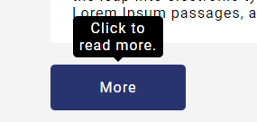

# Custom Web Tooltip Using HTML & CSS
Creating a **reusable** custom web tooltip element using only CSS and HTML.
Please refer to [YouTube video](https://youtu.be/ym1GpIhFEP4) for step by step explanation.

The process is to:
* Apply the _'tooltip-holder'_ class to our element on which we want to show the tooltip.
* Then add the tooltip element with _'tooltip'_ class and text inside the  parent element.
* And **Voila!** we are ready.

### Example:

**Code:**
```
<button class="tooltip-holder">
  More
  <span class="tooltip">Click to read more.</span>
</button>
```

**Output:**


